<table width="100%" border="0" style="border-collapse: collapse; border: none;">
  <tr>
    <td width="55%" align="left" valign="center" style="border: none;">
      <h1>Hi, I'm Mohit Sharma 👋</h1>
      
<b>Full-Stack Developer | AI Enthusiast | Open Source Contributor</b>

       
      
Motivated B.Tech CSE student passionate about building scalable software, AI applications, and interactive web experiences. Constantly learning and building production-ready projects.

      <ul>
        <li>🎓 B.Tech CSE (2025–2029) @ VMSBUTU, Dehradun</li>
        <li>💡 Exploring AI/ML, GenAI, and 3D Web Animations</li>
        <li>🤝 Merged Open Source PRs (e.g., pyfenn/fenn)</li>
        <li>💼 Open to Internships & Opportunities</li>
      </ul>
    </td>
    <td width="45%" align="center" style="border: none;">
      
    </td>
  </tr>
</table>

 

  

---

## 📊 GitHub Analytics

  

---

## 💻 Tech Stack & Skills

### 🌐 Programming Languages

  
  
  
  
  
  

### 🎨 Frontend & Design

  
  
  
  
  
  
  

### 🧠 AI & Machine Learning

  
  
  
  

### ⚙️ Backend, Databases & Tools

  
  
  
  
  

---

## 🚀 Featured Projects

### 🧠 ImageX - Offline AI Image Generator
> **Tech Stack:** Python, Flask, Stable Diffusion v1.5, PyTorch, Ollama (Llama 3.2), SQLite
* Built a fully offline text-to-image generation tool supporting CUDA/MPS/CPU fallback.
* Integrated Ollama (Llama 3.2) as a prompt enhancement engine to improve generation quality.
* Developed a Flask REST API backend with SQLite for generation history.

### 🎮 3D Interactive Portfolio
> **Tech Stack:** Next.js 14, TypeScript, React, Tailwind CSS, GSAP, Framer Motion
* Designed an immersive RPG-style developer portfolio with parallax layers and cinematic transitions.
* Built a custom game loop with collision detection, checkpoint system, and keyboard controls.
* Achieved smooth, high-performance animations using GSAP and Framer Motion.

 

  <b>🌟 <a href="https://github.com/mohit-sharma-001?tab=repositories">Check out my repositories for more awesome projects!</a> 🌟</b>

---

## 🏆 Certifications & Open Source

* **Open Source Contributor:** Merged PR #161 in `pyfenn/fenn` (Improved mobile responsiveness & dashboard UI).
* **Forage Job Simulations:**
  * Deloitte Technology Job Simulation
  * JPMorgan Chase Software Engineering Job Simulation
  * Skyscanner Front-End Software Engineering Job Simulation
  * Tata GenAI Powered Data Analytics & Data Visualisation

---

## 🌐 Let's Connect

  
  &nbsp;&nbsp;
  
  &nbsp;&nbsp;
  

 

  <i>"Consistency beats talent when talent doesn't work consistently."</i>

